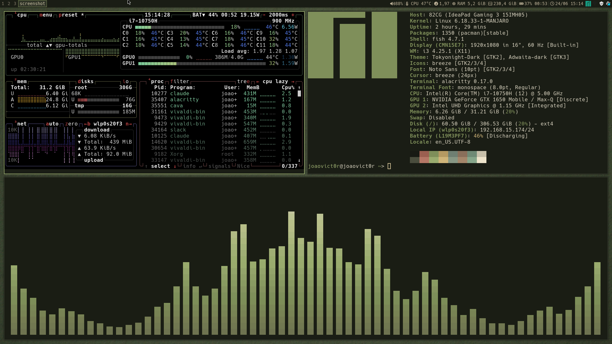

## Overview

> My personal Manjaro-based dots for i3 (X11). Minimalist style with an earthy matte palette (`#1a1d15` / `#9aac6f`). I use feh for the wallpaper, and the bar is i3status with custom Nerd Font icons. The shell is fish, and I use alacritty as the terminal with rofi as the launcher. I recommend a Nerd Font so everything looks nicer — I use Hack Nerd Font.

## Dependencies

| Category                 | Packages                                |
| ------------------------ | --------------------------------------- |
| **Window Manager**       | i3-wm                                   |
| **Status Bar & Widgets** | i3status                                |
| **Terminal**             | alacritty                               |
| **Launchers**            | rofi, network-manager-applet            |
| **Lock & Session**       | i3lock, dex                             |
| **Audio**                | pipewire, pamixer, pavucontrol          |
| **Notifications**        | dunst                                   |
| **Display & Power**      | brightnessctl                           |
| **Clipboard**            | xclip                                   |
| **Screenshots**          | maim, slop, xclip                       |
| **Utilities**            | feh, nnn, micro                         |
| **Fonts & Theme**        | ttf-hack-nerd, Adwaita-dark             |
| **System**               | fish                                    |

### Cursor

> I use breeze_cursors as my cursor theme.

## Keybinds

| Keybind             | Action                      |
| ------------------- | --------------------------- |
| `SUPER + P`         | App launcher (rofi)         |
| `SUPER + Return`    | Terminal (alacritty)        |
| `SUPER + E`         | File manager (nnn)          |
| `SUPER + N`         | Editor (micro)              |
| `SUPER + Q`         | Close window                |
| `SUPER + L`         | Lock screen (i3lock)        |
| `SUPER + F`         | Fullscreen                  |
| `Print`             | Screenshot region (maim)    |
| `SUPER + Shift + R` | Restart i3                  |
